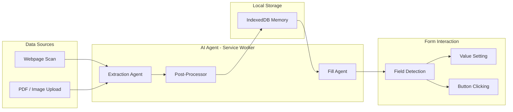

<p align="center">
  
</p>

<h1 align="center">Form Paglu</h1>

<p align="center">
  <strong>AI-powered Chrome extension that scans your profiles, builds a dynamic memory, and auto-fills any form.</strong>
</p>

<p align="center">
  <a href="https://github.com/kunalshah017/form-paglu/releases/latest">Download</a> •
  <a href="https://kunalshah017.github.io/form-paglu">Landing Page</a> •
  <a href="#features">Features</a> •
  <a href="#getting-started">Getting Started</a> •
  <a href="#architecture">Architecture</a>
</p>

---

## What is Form Paglu?

Form Paglu is a Chrome extension that uses AI to extract your personal/professional data from webpages and documents, stores it locally in your browser, and intelligently auto-fills any form you encounter — job applications, registrations, profiles.

**No server. No account. Your data stays on your machine.**

You bring your own API key (Google AI Studio is free).

---

## Features

| Feature | Description |
|---------|-------------|
| **Webpage Scanning** | Visit LinkedIn, portfolios, or any page — AI extracts 50+ structured facts |
| **PDF/Image Upload** | Upload resumes or documents — Gemini reads them with multimodal vision |
| **Smart Form Filling** | Iterative agent that fills fields, clicks "Add" buttons, writes personalized answers |
| **Dynamic Memory** | Local IndexedDB storage with search, edit, and category-based organization |
| **Framework-Aware** | Works with React, Vue, Angular, Svelte, MUI, Ant Design, custom ARIA components |
| **Multi-Provider** | Google AI Studio (free), NVIDIA NIM, OpenRouter, or any OpenAI-compatible API |
| **Interactive Agent** | Clicks buttons to reveal sections, verifies filled fields, retries gaps |
| **Privacy-First** | All data in browser IndexedDB. No telemetry. No external storage. |

---

## Quick Start

### Install from Release

1. Download the latest `.zip` from [Releases](https://github.com/kunalshah017/form-paglu/releases/latest)
2. Extract the zip file
3. Open `chrome://extensions` in Chrome
4. Enable **Developer mode** (top right)
5. Click **Load unpacked** → select the extracted folder
6. Click the extension icon → open side panel
7. Go to Settings → add your [Google AI Studio](https://aistudio.google.com/apikey) API key (free)

### First Use

1. Visit your LinkedIn profile (or any page with your data)
2. Click **Scan Webpage** — AI extracts your info into memory
3. Navigate to a job application form
4. Click **Fill out form** — done!

---

## Getting Started (Development)

### Prerequisites

| Tool | Version |
|------|---------|
| Node.js | >= 22.15.1 |
| pnpm | >= 10 |

### Setup

```bash
# Clone the repository
git clone https://github.com/kunalshah017/form-paglu.git
cd form-paglu

# Install dependencies
pnpm install

# Start development (with HMR)
pnpm dev
```

### Load in Chrome (Development)

1. Run `pnpm dev` (or `pnpm build` for production)
2. Open `chrome://extensions`
3. Enable **Developer mode**
4. Click **Load unpacked**
5. Select the `dist` folder
6. The extension reloads automatically on code changes (HMR)

### Production Build

```bash
pnpm build        # Build all packages
pnpm zip          # Build + create distributable zip
```

---

## Project Structure

```
form-paglu/
├── chrome-extension/          # Extension core
│   ├── manifest.ts            # Chrome MV3 manifest
│   ├── src/background/        # Service worker (AI agent, message routing)
│   │   ├── ai-agent.ts        # Extraction + Fill agents
│   │   ├── prompts.ts         # System prompts + Zod schemas
│   │   └── index.ts           # Message handlers (scan, fill, upload)
│   └── public/                # Static assets (icons, logo)
├── pages/
│   ├── side-panel/            # Main UI (side panel)
│   └── popup/                 # Popup fallback
├── packages/
│   ├── ui/                    # Shared React components
│   │   └── lib/components/    # HomeView, MemoryView, SettingsView, Header
│   ├── tailwindcss-config/    # Shared Tailwind config (colors, fonts)
│   ├── storage/               # Storage utilities
│   ├── shared/                # Shared constants
│   ├── vite-config/           # Shared Vite configuration
│   └── zipper/                # Build → zip packaging
├── docs/                      # Landing page (GitHub Pages)
├── test-forms/                # Test HTML forms for development
└── .github/workflows/         # CI/CD (release, lint, build)
```

---

## Architecture



### Key Design Decisions

- **Structured Output over Tool Calling**: Gemini 3.1 Flash Lite works best with `generateObject` (structured JSON output) rather than function calling for both extraction and form fill.
- **Iterative Fill Loop**: Up to 4 passes — click action buttons → fill new fields → verify → retry gaps.
- **Framework-Aware DOM Manipulation**: Uses native prototype setters (`HTMLInputElement.prototype.value.set`) to bypass React/Vue controlled components. Dispatches full event lifecycle (focus → input → change → blur).
- **LinkedIn URL Resolution**: Parses LinkedIn's interstitial HTML pages to extract real destination URLs from `lnkd.in` redirects.
- **Local-Only Storage**: IndexedDB with categorized facts. No sync. No server. Privacy by architecture.

---

## Supported Providers

| Provider | Base URL | Free Tier |
|----------|----------|-----------|
| **Google AI Studio** | `generativelanguage.googleapis.com` | 15 RPM, 500 RPD |
| **NVIDIA NIM** | `integrate.api.nvidia.com/v1` | Yes |
| **OpenRouter** | `openrouter.ai/api/v1` | Pay-per-use |
| **Custom** | Any OpenAI-compatible endpoint | — |

Default: **Gemini 3.1 Flash Lite** via Google AI Studio (free, fast, reliable structured output).

---

## Scripts

| Command | Description |
|---------|-------------|
| `pnpm dev` | Development with HMR |
| `pnpm build` | Production build |
| `pnpm zip` | Build + zip for distribution |
| `pnpm lint` | Run ESLint |
| `pnpm lint:fix` | Fix lint errors |
| `pnpm type-check` | TypeScript type checking |
| `pnpm update-version <x.y.z>` | Update version across all packages |

### Install Dependencies

```bash
# Root dependency
pnpm i <package> -w

# For a specific package
pnpm i <package> -F <package-name>

# For the chrome extension
pnpm i <package> -F chrome-extension
```

---

## Tech Stack

- **Runtime**: Chrome Extension MV3 (Service Worker)
- **UI**: React 19 + Tailwind CSS
- **AI**: Vercel AI SDK (`ai`, `@ai-sdk/google`, `@ai-sdk/openai`)
- **Structured Output**: `generateObject` with Zod schemas
- **Storage**: IndexedDB (raw API, no ORM)
- **Build**: Vite + Turborepo + pnpm Workspaces
- **Language**: TypeScript (strict, NodeNext modules)
- **Design System**: Doodle (Delius Swash Caps font, dashed borders, hand-drawn aesthetic)

---

## Contributing

1. Fork the repository
2. Create a feature branch: `git checkout -b feat/my-feature`
3. Make your changes
4. Build and test: `pnpm build`
5. Commit with conventional commits: `git commit -m "feat: add X"`
6. Push and create a Pull Request

### Commit Message Tags

| Tag | Effect |
|-----|--------|
| `[minor]` | Bumps minor version (0.x.0) |
| `[major]` | Bumps major version (x.0.0) |
| `[skip ci]` | Skips CI workflow |
| (none) | Auto patch bump (0.0.x) |

---

## License

Copyright (C) 2026 Kunal Shah

This project is licensed under the **GNU General Public License v3.0** with additional attribution and trademark terms. See [LICENSE](LICENSE) for details.

You are free to use, modify, and distribute this software under GPL-3.0, provided that:
- Derivative works are also open-sourced under GPL-3.0
- Attribution to "Form Paglu by Kunal Shah" is maintained
- The "Form Paglu" name and logo are not used without permission

---

<p align="center">
  Built with ❤️ by <a href="https://github.com/kunalshah017">Kunal Shah</a>
</p>
